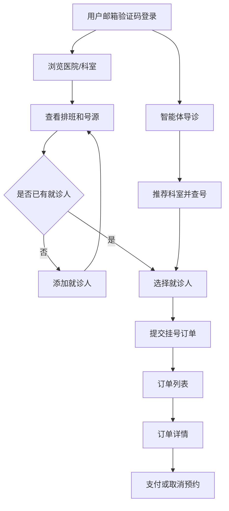
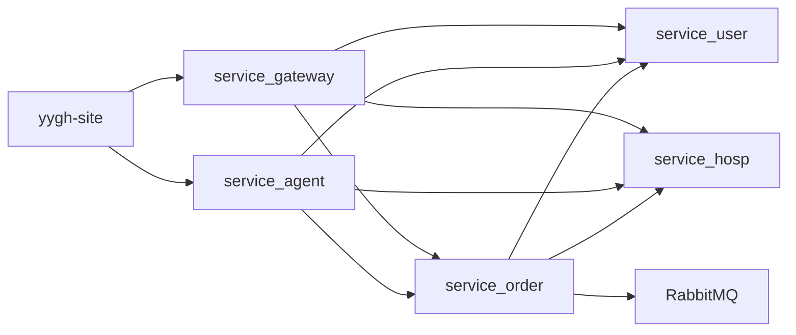

# 尚医通本地演示系统需求文档

## 目标

本项目是一个预约挂号演示系统，支持用户通过邮箱验证码登录，浏览医院与科室排班，添加就诊人，并通过网页或智能体创建挂号订单。当前本地演示规则为：实名认证仅保留入口，不作为预约前置条件；预约必须绑定当前登录账号下的就诊人。

## 前端功能清单

| 页面/组件 | 可点击功能 | 期望行为 | 后端/API |
| --- | --- | --- | --- |
| 顶部导航 | 登录、退出、个人中心、我的订单 | 登录后写入 token，所有 auth API 带 token | `service_user /api/user/login` |
| 首页 | 搜索医院、快捷进入医院、智能体 | 查看医院列表、进入医院详情、打开智能问诊 | `service_hosp`、`service_agent` |
| 医院主页 | 科室点击 | 登录后进入排班页；不再检查实名认证 | `service_hosp /api/hosp/hospital/*` |
| 排班页 | 日期、专家号/普通号 | 选择可预约号源并进入预约确认页 | `service_hosp /api/hosp/hospital/auth/*` |
| 预约确认页 | 选择就诊人、添加就诊人、确认挂号 | 必须选择当前账号下的就诊人，创建订单 | `service_user /patient/auth/findAll`、`service_order /submitOrder` |
| 就诊人管理 | 新增、查看、编辑、删除 | 数据只属于当前登录用户；编辑接口可用 | `service_user /api/user/patient/auth/*` |
| 挂号订单 | 筛选、分页、查看详情 | 只展示当前登录用户订单 | `service_order /api/order/orderInfo/auth/*` |
| 订单详情 | 支付、取消预约 | 只能查看/取消当前登录用户订单 | `service_order`、`service_order/weixin` |
| 智能体 | 导诊、查号、确认挂号、查看订单 | 使用当前 token 取当前账号第一个就诊人并提交订单 | `service_agent` + Feign 调用用户/医院/订单服务 |

## 当前实现差距与处理

| 问题 | 原因 | 本次处理 |
| --- | --- | --- |
| 不同账号看到同一批历史订单 | 历史订单使用演示账号 `user_id=1`，未归入目标账号 | 新增迁移脚本，将历史订单绑定到 `jiang.wenrui@outlook.com` 对应用户 |
| 预约未严格绑定用户身份 | 前端可传任意 patientId，必须由后端校验 | `OrderServiceImpl.saveOrder` 已校验 patient.userId，本次继续保留 |
| 未实名认证无法进入排班 | 前端医院主页点击科室时强制检查 `authStatus=2` | 已移除该阻断，添加就诊人后即可预约 |
| 修改就诊人失败 | 前端调用 `PUT /auth/update`，后端只接 `POST` | 前端改为 POST，后端兼容 POST/PUT |
| 就诊人越权风险 | 查看、修改、删除未校验当前用户归属 | 后端补充当前用户归属校验 |
| 订单详情进不去 | 历史订单不属于当前用户时详情接口返回权限错误 | 迁移历史订单到默认账号，详情接口继续保留权限校验 |
| 实名认证提交接口拼写错误 | 前端调用 `/userAuah`，后端实际为 `/userAuth` | 已修正接口路径 |

## 功能示意图

## 后端边界

